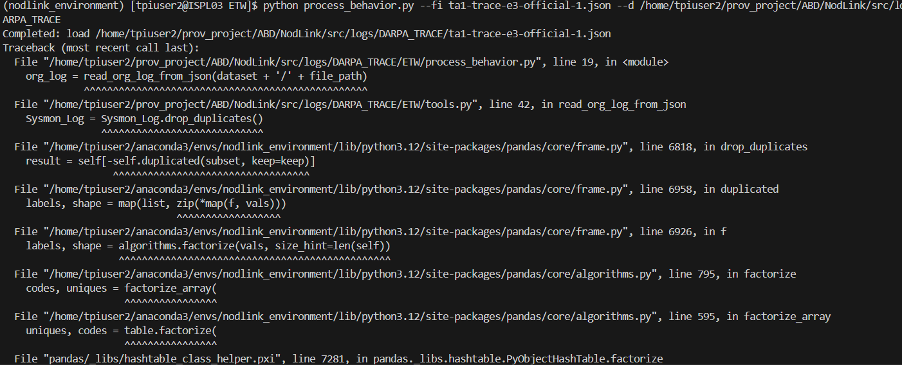

# Pass 2 Update

## Issues 

- **Request for Additional Datasets**  
  The paper mentions the use of three additional datasets: Industrial Arena, In-Lab Arena, and Open World. These datasets were not found in the repository. A GitHub issue was created requesting the following clarifications:
  - Availability of these datasets or the location where they can be accessed.
  - Whether the three datasets included in the repository (Win10, Win12, and Ubuntu) correspond to any of these three categories (Industrial Arena, In-Lab Arena, and Open World).

- **Challenges with DARPA Datasets**  
 An issue was encountered with the DARPA dataset . The format of the DARPA dataset E-3 TRACE does not align with the dataset format used in the repository for the three datasets (Win10, Win12, and Ubuntu). As a result, the `process_behavior.py` file cannot be run on the DARPA datasets for parsing as it throws errors shown below:

 

  
  A GitHub issue was created requesting the following:
  - The exact labelled DARPA datasets (benign and anomalous) used in the system.
  - The parsing code or preprocessing steps required to convert the DARPA datasets into the format compatible with NodLink.
