# Sampled Data Information  

## Issues  

- **Missing Package Dependencies:**  

  Many required packages for setting up the environment were not mentioned in the README file, such as:  
    - `torch`  
    - `scipy`  
    - `tqdm`  
    - `matplotlib`  
    - `nostril` (specific for HW17 dataset)  
    - `streamz`  
    - `nearpy`  
    - `schedule`  
  This made setting up the environment more challenging and required manual identification and installation of these dependencies.  

  Evidence:

  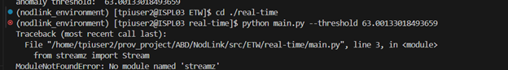

  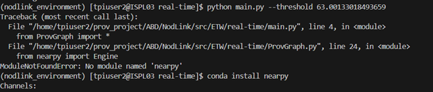

- **Incorrect Import Statement:**  

  The code in `train.py` and `calculate_weight.py` used the import statement `scipy.sparse.linalg.eigen`, which is not a valid module. This was fixed by updating it to `scipy.sparse.linalg` and importing `eigsh` for the required functionality. 

   Evidence:

  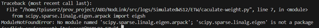
  

- **Unlabeled Print Statements:**  

  The code frequently outputs values without clear labels or context. For instance, values are printed without descriptive text, making it difficult to understand their meaning. This required tracing the code to determine what each printed value represents.

  Evidence:  

    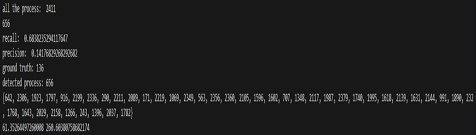

    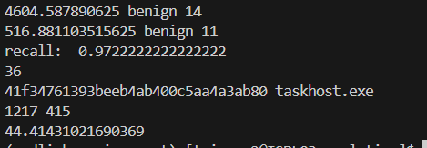

- **Incorrect Flag in Readme:** 

  The flag mentioned to run main.py in README file for threshold is incorrect where it says it is --threshold but in actual it is --t as configured in code.

  Evidence:

  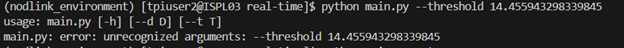

- **Missing Directory:**   

  Dot folder does not exist in the repository so had to create it on my own.

   Evidence:

  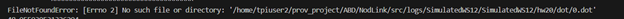

- **Absence of Results in Paper**   (issue to post?)
  Since the results for Preprocessing are not mentioned in their paper so the printed results can not be verified. An example of such results is:

  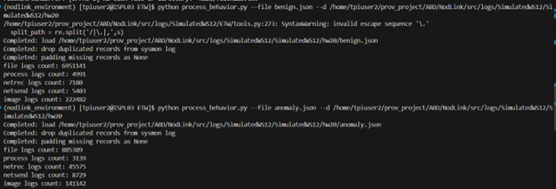

- **Unclarity on Open World Dataset**   (issue to post?)

  In paper they talk about an Open World dataset that they created comprising of the three datasets given in the repository: 
  - **SimulatedW10**  
  - **SimulatedW12**  
  - **SimulatedUbuntu** 

  However, in paper they do not mention the results for each of them. They have just mentioned one result so it is unclear for which dataset have they mentioned the result.
 

## Progress  

- Successfully ran preprocessing, training, and testing on the following datasets provided in the repository:  
  - **SimulatedW10**  
  - **SimulatedW12**  
  - **SimulatedUbuntu**  

## Output  

- Output files and metrics were generated for the datasets mentioned above. These include trained models and testing results stored in the respective result directories.  

- Output of real-time testing on SimulatedW10:

  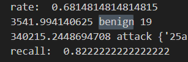

- Output of real-time testing on SimulatedW12:

  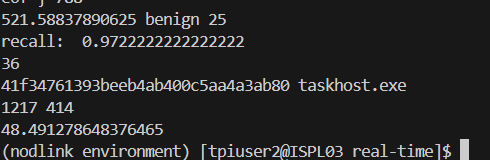

- Output of real-time testing on SimulatedUbuntu:

  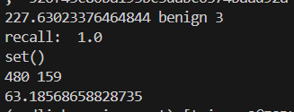
